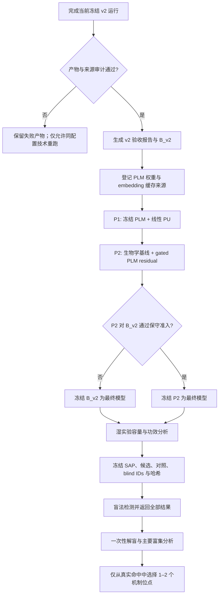

# Tomato PLM-PU 模型到盲法实验执行准备规范

> 日期：2026-08-11  
> 状态：设计已确认；仅用于后续任务拆分与审查  
> 当前边界：不修改、不重启、不提前解释正在运行的 `tomato_ranker_v2`；不授权 v3 训练或候选发布

## 1. 决策摘要

当前 `tomato_ranker_v2` 完成后先作为冻结开发基线接受审查。下一轮只增加一个主要方法学问题：在相同的 PU 标签语义、同源簇切分和 panel 主评价场景下，冻结蛋白语言模型（PLM）的低容量残差是否稳定优于 v2 选出的模型。最终模型只选择一次，之后才进行功效分析、冻结候选和盲法湿实验。

不把 BERT、GRU、GNN 或结构模块的堆叠数量作为创新主张。方法学主张限定为：**面向植物 persulfidation 的层级残差 PU 排序，在同蛋白检测偏差、同源泄漏和跨作物迁移边界下产生可盲法检验的 Top-K 候选。**

## 2. 总体流程

## 3. Phase A：当前 v2 运行验收

### 3.1 不可变输入

- 配置：`configs/experiments/tomato_ranker_v2.yaml`
- 初始工作流实现参考：提交 `2870856a8ab2462bc7981f41c9b74f16d8b925aa`；真实运行必须在 manifest 中绑定实际执行时的代码提交和配置 SHA256。若在新一轮运行开始前批准了仅影响加速/日志、不改变科学语义的版本，则该版本必须先通过数值等价测试并形成独立提交
- 番茄参考蛋白组与 MMseqs2 簇：`data/registry/model_inputs.tsv` 中登记的冻结文件
- KIAE271 补充表：已登记来源和 SHA256
- 主场景：`panel`
- 审计场景：`proteome`
- 外层评估：5 折同源簇分组 × 5 次重复；模型种子 0–4
- 标签：仅 `positive` 与 `unlabeled`

单次运行开始后禁止修改配置、特征、先验区间、折叠、模型种子、并行策略或输出目录。性能较慢不构成中途改变该次实验的理由；如需采用经过审查的加速实现，应终止旧运行、保留日志，在新目录从头运行，并证明加速前后数值等价。

### 3.2 产物完整性验收

预期结果目录必须是新目录，并至少包含：

- `summary.json`
- `oof_scores.json`
- `rank_summaries.json`
- `frozen_models.json`
- `candidate_scores.json`
- `manifest.json`

验收检查：

1. 配置、KIAE271、参考蛋白组、簇表、冻结模型和候选分数哈希齐全；
2. 运行时工作区无未登记的科学代码差异；若存在经过批准的执行补丁，manifest 必须记录补丁 SHA256；
3. 25 个 panel 外层运行和 25 个 proteome 外层运行完整，不选择最佳 seed；
4. 每个 OOF 位点只在其测试折评分，训练折与测试折无同源簇交叉；
5. 无 NaN、无坐标越界、无非 Cys 位点、无未登记输入；
6. `candidate_registry_count` 与候选分数行数一致；
7. 产物 claim class 保持 `development_candidate_ranking_not_gate2`。

技术失败时不得覆盖目录。应保留失败日志并在新目录用完全相同配置重跑；若需要改变科学参数，必须建立新的版本和独立审查任务。

### 3.3 v2 模型选择

沿用现有 `admit_candidate_model`：在 panel arena 上对 Recall@50、AP/base-rate enrichment 和 MRR 做按重复块配对的 bootstrap 区间，并执行 leave-one-repetition-block-out 稳定性检查。三个指标的区间下界和留一稳定性都必须大于 0，additive PU 才能替代 PU-logistic；否则 `B_v2` 自动取 PU-logistic fallback。

proteome arena 只用于部署压力测试、适用域和蛋白检测偏差审计，不参与 A/B 模型选择。

## 4. Phase B：v3 PLM 残差预注册开发

### 4.1 启动条件

只有在 v2 产物完整、验收报告被审查后才启动。PLM 权重必须登记：模型全名、发布版本、官方来源、许可、下载日期、文件大小和 SHA256。任何 embedding 缓存还必须绑定：

`PLM权重哈希 + 番茄FASTA哈希 + embedding代码提交 + pooling规范`

已有 `esm2_t33_650M_UR50D` 基线可作为首选复用对象，但若其本地权重缺少完整来源记录，则先停止并补齐 provenance，不能以缓存存在代替登记。

### 4.2 固定模型比较矩阵

| Arm | 表征 | 训练头 | 用途 |
|---|---|---|---|
| `B_v2` | 六维生物学核心特征 | v2 选出的 additive PU 或 PU-logistic | 强制参考模型 |
| `P1_plm_linear_pu` | 冻结 PLM 的 Cys 残基与 ±15 局部均值表征 | 正则化线性 nnPU + 同蛋白 pairwise | 判断 PLM 表征本身是否有增益 |
| `P2_bio_plm_residual` | 六维核心特征 + 冻结 PLM 表征 | 生物学基线 + 低容量 gated residual | 预注册主候选 |
| `P3_plm_bigru_pu` | ±15 的逐残基 PLM 表征 | 小型 BiGRU + nnPU/pairwise | 可选方向性消融，不参与主模型叙事，除非预先单独批准 |

Sul-BertGRU 的原始二分类结果只作为文献背景。除非在完全相同的番茄输入、PU 标签和同源簇折叠下重新实现，否则不得把其发表指标与本项目指标放在同一性能表中。

### 4.3 P1/P2 表征与容量边界

- PLM 全部冻结，不做端到端微调；
- 每个 Cys 提取中心残基 embedding 和 Cys±15 的掩码均值；
- 拼接后的缩放与 PCA 只在当前训练折拟合，固定降至 32 维；
- `P1` 使用线性头；
- `P2` 的 residual 至多一层 16 单元隐藏层，不能读取 accession、物种、研究、结构可用性或检测状态；
- residual 门控强度只允许在训练折内部从 `{0, 0.25, 0.5, 1.0}` 选择；
- 内层模型选择使用 3 折同源簇分组，外层测试折在选择完成前不可读；
- 保持 v2 的先验敏感性集合、外层折叠、重复次数、模型种子和 unlabeled 采样策略。

主损失：

\[
L = L_{nnPU} + \lambda L_{within\text{-}protein\ pairwise}
  + \eta \lVert\theta_{residual}\rVert_2^2
\]

未标注位点在任何环节都不转换为实验阴性。若某蛋白内没有可构造的 pair，保留其 nnPU 风险但不伪造 pair。

### 4.4 v3 准入和停止条件

`P2` 必须以与 v2 相同的 panel arena、外层 OOF 运行和 `admit_candidate_model` 与 `B_v2` 配对比较。只有三个指标全部通过，`P2` 才成为最终模型；否则冻结 `B_v2`。

- `P1` 优于 `B_v2`、但 `P2` 不通过：保留为表征结果，不自动发布 P1；需新任务决定是否比较 P1 与 `B_v2`。
- `P3` 优于 P2：只能形成新的候选任务，不能回写本次预注册选择。
- 结构分支默认关闭；只有独立结构准入任务在覆盖匹配的 panel 分层中通过，才允许形成后续版本。
- 不允许因某个 seed、某个 fold 或 proteome arena 表现突出而放宽准入。

## 5. Phase C：最终模型到盲法湿实验的接口

### 5.1 冻结前置条件

1. 最终模型、特征版本、PLM 权重、折叠、先验和候选宇宙均已哈希；
2. 模型选择结束，后续不再用 KIAE271 或未来盲法结果调参；
3. 合作方确认统一检测流程、样品能力、批次安排、原始文件返回和解盲条件；
4. 根据预期背景命中率、目标富集、显著性水平和功效计算实验容量；
5. K 由功效和实验容量决定，不由候选分数分布决定。

### 5.2 冻结候选组成

- `T` 主臂：最终番茄模型选择的高排名、适用域内、低不确定性位点；
- `X` 副臂：只有 target-label-free 跨作物任务独立过门时启用，最多占非对照候选的 25%；
- matched-unlabeled controls：按预注册变量匹配，名称明确为未标注对照而非阴性；
- process-positive controls：验证实验流程，不计入新候选命中率；
- 默认每个蛋白最多一个新位点，并限制同源家族和通路过度集中。

冻结包必须包含原始排名、去冗余后排名、blind ID、隐藏臂标签、匹配层、模型与输入哈希、主要终点、排除规则、统计计划和全结果返回要求。冻结后零重排。

### 5.3 主要湿实验终点

主要问题是：高排名 T 臂相对于 matched-unlabeled controls 是否富集真实 persulfidation 命中。高低排名、已知阳性和所有候选使用相同的检测、排除和批次规则；失败候选必须保留。

统计单位优先为独立蛋白，每个蛋白默认一个位点。主要分析在解盲后一次完成；批次、操作者、原始文件、排除原因和不可判定结果全部登记。

### 5.4 命中后的 1–2 个机制位点

只有真实盲法命中后才能选择中心机制位点。后续证据按层级推进：

1. 位点级 persulfidation 复核；
2. Cys→Ser/Ala 突变并确认表达与稳定性；
3. 功能、表型及必要的遗传/生化救援；
4. 有具体诱饵—伙伴假设时，再做二元互作预过滤、AF3/Boltz 复合体复核和 PLIP 接触解释；
5. 对接/MD 比较 WT-SH、Cys-SSH 与突变体构象；若主张成键或硫转移反应，需要 QM/MM。

模拟结果不得修改原候选排名，也不能替代位点和功能实验。

## 6. 任务拆分与审批顺序

| Task | 内容 | 是否产生新科学结果 | 启动门槛 |
|---|---|---:|---|
| E0 | v2 产物审计和验收报告 | 否，只解释已批准运行 | v2 运行结束 |
| E1 | PLM 权重和 embedding 缓存 provenance | 否 | E0 被审查 |
| E2 | P1 线性 PLM-PU 基线 | 是，开发结果 | E1 完成，单独批准 |
| E3 | P2 gated residual PU | 是，开发结果 | E2 审查，单独批准 |
| E4 | 可选 P3 BiGRU-PU 消融 | 是，开发结果 | P2 后仍存在方向性问题 |
| E5 | 最终模型一次性准入与冻结 | 是 | E2/E3 完整 OOF |
| E6 | 湿实验功效、SAP 和合作协议冻结 | 否 | E5 完成、实验容量确认 |
| E7 | 候选 blind release | 是，前瞻发布包 | E6 通过 release gate |
| E8 | 盲法实验与一次性解盲分析 | 是 | E7 已冻结并移交 |
| E9 | 1–2 个真实命中的机制实验 | 是 | E8 完成且存在合格命中 |

每个软件行为任务继续执行严格 TDD、科学完整性测试和独立 commit。每个真实模型运行、候选发布和湿实验阶段均需要单独批准。

## 7. 失败分支与允许主张

| 结果 | 动作 | 允许主张 |
|---|---|---|
| v2 技术产物不完整 | 保留失败日志；相同配置新目录重跑 | 无性能结论 |
| additive PU 未通过 v2 准入 | `B_v2=PU-logistic` | 简单模型回退；开发排序 |
| P2 未通过 v3 准入 | 冻结 `B_v2` | PLM 残差无稳定增益 |
| P2 通过 | 冻结 P2 | 番茄单研究内同源簇开发增益 |
| 功效分析不支持现有实验容量 | 不发布候选或缩小主张，不降低命中阈值 | 方法准备完成 |
| X 副臂未过门 | 关闭 X，只执行 T | 番茄主臂前瞻验证 |
| 盲法 T 不富集 | 保留全部结果并停止调参 | 前瞻负结果或边界分析 |
| T 富集且多蛋白独立命中 | 进入 1–2 位点机制实验 | 前瞻候选富集；非普适机制 |

## 8. 本规范不授权的动作

- 修改或重启当前 v2 训练；
- 下载或使用未登记的 PLM 权重；
- 立即实现 P1/P2/P3；
- 根据当前结果改变指标、阈值、K 或折叠；
- 在最终模型选择前发布候选；
- 把任何模拟结果写成实验机制；
- 在盲法结果返回后重新排序或删除失败候选。

## 9. 审查检查表

- [x] 当前运行与未来模型开发相互隔离；
- [x] v2、v3 和 blind release 各有独立停止门；
- [x] 未观察不等于阴性；
- [x] panel 为主、proteome 为审计；
- [x] PLM 预处理和门控选择为 fold-local；
- [x] 复杂模型失败时自动保留简单模型；
- [x] 结构、跨作物和机制模拟均为条件分支；
- [x] K 等待功效与合作方容量，不从结果反推；
- [x] 冻结后零重排，所有湿实验结果保留；
- [x] 没有预填性能、命中率或机制结论。
